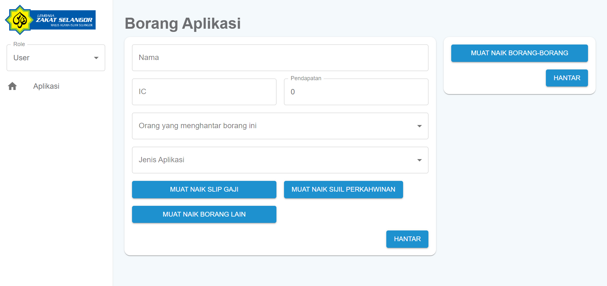
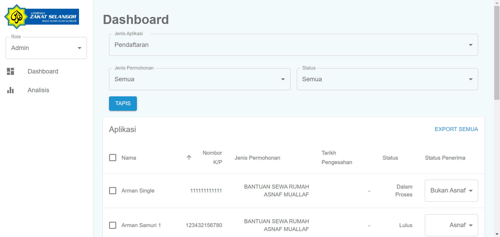
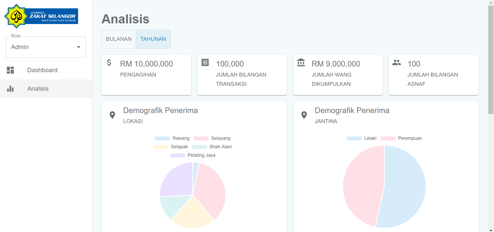

# LZS

A project that aims to streamline the zakat distribution processes.

## User Interface

### Home Page - User View

In this page, users could fill up the form to submit their personal details. They are required to download the form by clicking "Muat naik borang-borang" in the system in order to upload them again in the system.

 

### Dashboard Page - Admin View

This page renders a list of application submissions from users. Admin could filter the application submissions based on type and status.

 

### Analysis Page - Admin View

The analysis page provides high-level overview to the zakat distribution. Some examples of metric include Total Distribution amount, Receiver Demographic etc.

## Reference

### Building-a-scalable-node-js-express-app

1. https://medium.com/@zurfyx/building-a-scalable-node-js-express-app-1be1a7134cfd
2. https://www.youtube.com/watch?v=fgTGADljAeg

### Download csv

https://dev.to/davidokonji/generating-and-downloading-csv-files-using-express-js-1o4i
